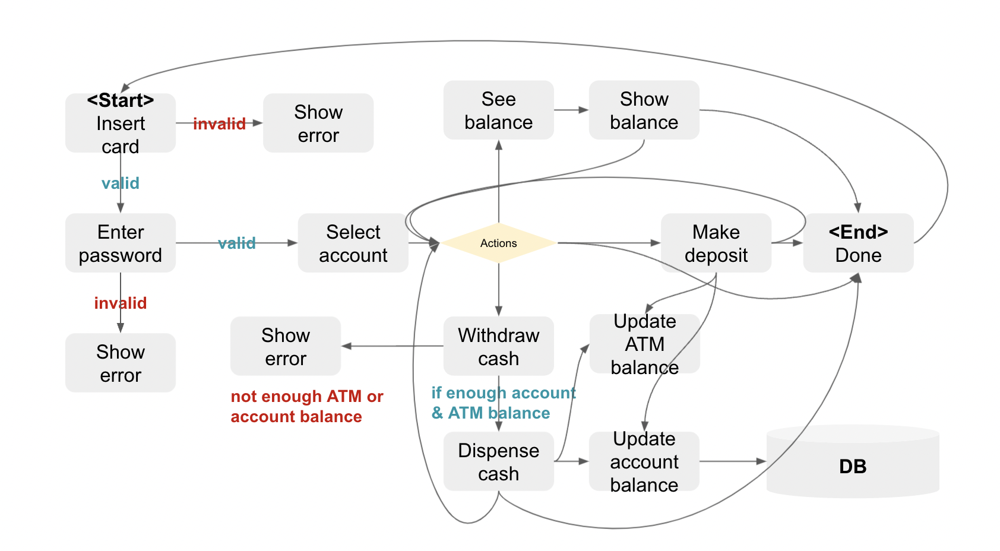

# ATMcontroller
ATM Controller that allows you to see your bank balance according to the flowchart above.

## Description
ATM Controller works as follows:
1. User inserts a card.
2. If valid, user is prompted to enter the PIN number.
3. If PIN valid, the user is prompted to select between savings or checking account. 
4. Once account type is selected, user can choose among three options: see balance, make deposits or withdraw cash.
5. If invalid PIN is entered three times, account will be locked and will only be able to be unlocked by calling the bank.
6. If not enough bank account balance, the user will not be able to withdraw cash.
7. If not enough cash in the ATM, the user will not be able to withdraw cash. 

## Build
No additional packages are use with this project.

## Run
`python3 controller.py`
Run this command on your terminal to run ATM Controller.  
Press `ctrl + c` to exit the program. 

## Test
### Sample Database File (JSON)
Sample database file is given as `./resources/sample_db.json`. Please follow the data structure in this file when later connected to a database.

### Testing variables
#### Accout Number
Since account number is retrieved by contacting bank after inserting credit card, account number is to be entered by the user at the moment. To connect is with the machine, please modify `getAccountNumber` function in `ATM` class within `models.py` file. 

#### PIN
PIN is not stored in the database, but a token. To run tests with sample data, PIN numbers for all example accounts are set to 1234, so please use `1234` as PIN for all test cases. 

#### Amount Inserted
Because the ATM checks how much money is inserted when making a deposit, amount inserted is to be entered by the user at the moment. To connect is with the machine, please modify `getInsertedAmount` function in `ATM` class within `models.py` file. 